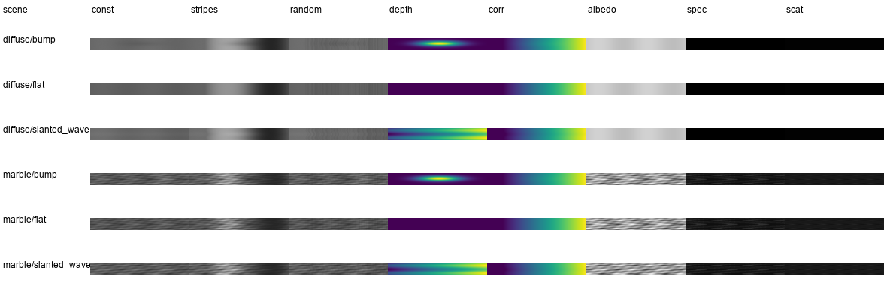

# 自检实验报告

## 实验设置

本实验用于检查渲染器的基础输出是否合理。当前自检覆盖 2 种材质和 3 种深度，共 6 个场景：

- 材质：`diffuse`、`marble`
- 深度：`flat`、`bump`、`slanted_wave`
- 输入图案：`constant`、`stripes`、`random`

每个场景都会保存输入图案、代表相机观测图、深度图、几何对应真值图和材质贴图。

## 生成结果

## 自检结果

正常。

- `flat` 深度图为常量平面，`bump` 深度图在中心有凸起，`slanted_wave` 深度图呈横向倾斜并带波纹，三种几何设置都按预期生成。

- 所有场景中的 `ground_truth_correspondence` 都是连续平滑的横向映射，没有明显断裂、空白或异常跳变，说明相机像素到投影仪列坐标的几何对应关系合理。

- `constant` pattern 为中灰常量图，对应的相机成像图主要体现材质、深度 shading 和噪声；`stripes` 成像图保留条纹结构，并随深度和材质发生微小变化；`random` 成像图不是空图，也没有整体饱和。这说明图案生成、投影采样和相机观测链路是有效的。

- `diffuse` 的 `specular` 和 `scattering` 基本为零，符合漫反射基准材质；`marble` 具有明显纹理、镜面项和散射项，满足大理石材质自检要求。
